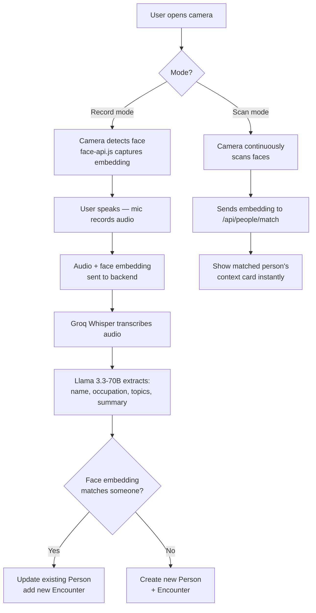

# Recall — AI-Powered People Memory App

> Point your camera at someone, record the conversation, and never forget who you talked to again.

Recall is an AI-powered **personal CRM** built around a camera and voice — not manual data entry. It automatically identifies people by face, transcribes what you discussed, and builds a full conversation history over time.

---

## How It Works



---

## Tech Stack

### Backend (this repo)

| Layer | Tech |
|---|---|
| Framework | Express.js |
| Language | TypeScript |
| Database | PostgreSQL via **Prisma ORM** |
| AI / Speech | **Groq** — Whisper large-v3 (transcription), Llama 3.3-70B (extraction) |
| Auth | JWT middleware |
| File Uploads | Multer |

**Runs on:** `http://localhost:8000`

### Frontend

| Layer | Tech |
|---|---|
| Framework | Next.js (App Router) |
| Language | TypeScript |
| Styling | Tailwind CSS |
| HTTP Client | Axios |
| Face Detection | `face-api.js` (SSD MobileNet + FaceRecognition nets) |
| Icons | Lucide React |
| Auth | JWT stored in `localStorage` (`pf_token`) |

**Runs on:** `http://localhost:3000`

---

## Database Schema

```
User
 ├── id (Int, autoincrement)
 ├── username (unique)
 ├── email (unique)
 └── password

Person
 ├── id (cuid)
 ├── userId → User
 ├── name?
 ├── occupation?
 ├── notes?
 ├── faceEmbedding (JSON — 128-dim float array)
 ├── photoUrl?
 ├── createdAt
 └── encounters → Encounter[]

Encounter
 ├── id (cuid)
 ├── personId → Person
 ├── transcript?
 ├── summary?
 ├── topics? (JSON array of strings)
 ├── location?
 └── date (default: now)
```

A **Person** can have many **Encounters**. Every conversation creates a new Encounter rather than overwriting the previous one — building a complete history over time.

---

## API Reference

### Auth — `/auth`

| Method | Route | Description |
|---|---|---|
| POST | `/auth/register` | Create a new account |
| POST | `/auth/login` | Authenticate and receive a JWT |

### People — `/api/people` *(auth required)*

| Method | Route | Description |
|---|---|---|
| GET | `/api/people` | List all people (1 latest encounter each) |
| GET | `/api/people/:id` | Get a person's full profile + all encounters |
| POST | `/api/people/match` | Match a face embedding → returns the matched person |
| DELETE | `/api/people/:id` | Delete a person and all their encounters (cascading) |

### Encounters — `/api/encounters` *(auth required)*

| Method | Route | Description |
|---|---|---|
| POST | `/api/encounters` | Upload audio + embedding → transcribe → extract → save |

---

## AI Pipeline

Each recording goes through a two-step AI pipeline powered by **Groq**:

1. **Whisper large-v3** → raw transcript from audio
2. **Llama 3.3-70B** → structured JSON extraction:

```json
{
  "name": "Alice",
  "occupation": "designer",
  "topics": ["startup ideas", "Bangalore move"],
  "summary": "Alice is a product designer moving to Bangalore..."
}
```

New information is **merged non-destructively** — existing `name` / `occupation` on a Person record are never overwritten by a later encounter.

---

## Face Matching

Both frontend and backend use **128-dimensional face embeddings** with **Euclidean distance**:

```
distance = sqrt( sum( (a[i] - b[i])² ) )
```

A threshold of **0.5** is used:
- Distance **< 0.5** → same person (add Encounter to existing record)
- Distance **≥ 0.5** → new person (create Person + Encounter)

No manual tagging required — recognition is purely based on facial geometry.

---

## Frontend Pages

| Route | Description |
|---|---|
| `/` | Dashboard — all people, grouped by Today / Yesterday / This Week / Earlier |
| `/camera` | Camera hub |
| `/camera/record` | **Record mode** — detects face, records audio, submits to backend |
| `/camera/scan` | **Scan mode** — live face recognition, shows context card on match |
| `/camera/person/[id]` | Person detail page — full encounter history |
| `/login` | Login screen |
| `/register` | Register screen |

---

## Getting Started

### Prerequisites

- Node.js ≥ 18
- PostgreSQL
- A [Groq](https://console.groq.com) API key

### Backend Setup

```bash
# Install dependencies
npm install

# Set up environment variables
cp .env.example .env
# Fill in DATABASE_URL and GROQ_API_KEY

# Run Prisma migrations
npx prisma migrate dev

# Start development server
npm run dev
```

### Frontend Setup

```bash
cd ../recall-frontend

npm install
npm run dev
```

> **Note:** `face-api.js` models are loaded from `/public/models` at runtime. Make sure the SSD MobileNet, Face Landmark 68, and Face Recognition net weights are present there before starting the frontend.

---

## Project Status

| Feature | Status |
|---|---|
| Auth (register / login / JWT) | ✅ Done |
| Record mode (face detection + audio) | ✅ Done |
| Whisper transcription + LLM extraction | ✅ Done |
| Face embedding match-or-create logic | ✅ Done |
| Dashboard with relative time grouping | ✅ Done |
| Scan mode (live recognition + context overlay) | ✅ Done |
| Person detail page (full encounter history) | ✅ Done |
| Delete person (cascading encounter deletion) | ✅ Done |
